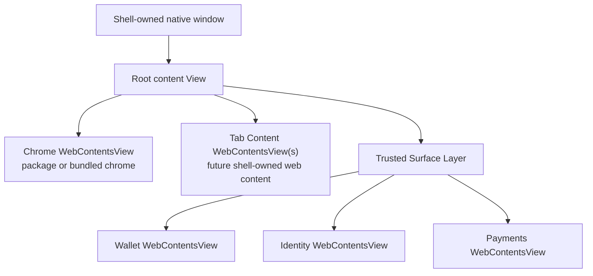
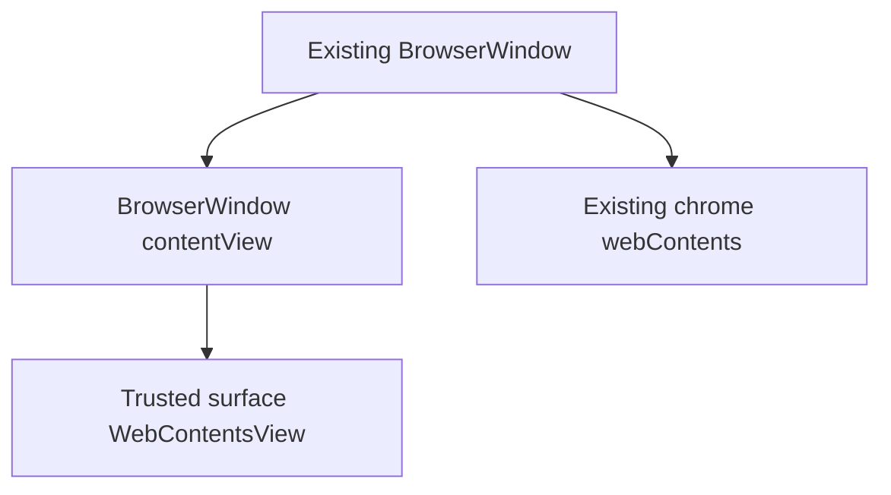

# Shell Compositor And WebContentsView Architecture

**Date:** 2026-06-25  
**Status:** Research draft  
**Scope:** Desired architecture for package chrome, shell-owned trusted surfaces,
and a future main-process compositor built around Electron `WebContentsView`.

---

## Executive Summary

Local package chrome has made the trust boundary honest: the browser chrome can
no longer casually read wallet, identity, node, settings, or provider internals
through the broad bundled preload. That is correct, but it exposes the next
architectural problem.

Today, the main `BrowserWindow` is effectively "the chrome window." The chrome
renderer owns the visible layout, creates guest `<webview>` tabs, and used to
host wallet/sidebar/settings UI directly. Package mode needs a different
shape:

> Main should become the compositor and layout owner. Browser chrome should be
> one replaceable view inside a shell-owned native window, not the owner of the
> whole window.

The target architecture is a shell-owned window composed from multiple
main-created views:

- a package/bundled **chrome view**
- shell-owned **trusted surface views** for wallet, identity, payments, Swarm
  publish, permissions, and sensitive settings
- eventually shell-owned **tab content views**, replacing package-owned
  transitional `<webview>` tabs

Electron `WebContentsView` is the relevant primitive. It is a native `View`
with its own `webContents`, preload, permissions, lifecycle, and bounds. It is
not DOM inside package chrome. Main can attach it to a window's content view,
set bounds, show/hide it, and load trusted shell UI into it.

The important product consequence:

> Package chrome may request that a shell surface open or close, but shell
> decides whether that surface is a drawer, modal, sheet, panel, overlay, or
> detached fallback window. Chrome does not choose the trusted surface's size,
> position, contents, preload, or security context.

---

## Why This Exists

The package runtime has made several regressions visible:

- node menu controls can render desired state without fresh runtime telemetry
- shell-owned settings appear unavailable inside package-hosted settings pages
- wallet opens as a separate trusted window rather than the previous integrated
  sidebar
- package chrome correctly lacks wallet, identity, Swarm provider, dApp
  permission, and broad Electron globals

These are not random frontend bugs. They are symptoms of a deeper split:

- **Authority:** who can know or change the truth?
- **Presentation:** who draws the UI?
- **Placement:** who decides where the UI appears?

The old bundled renderer collapsed all three. Package chrome separates them.
This document specifies the architecture we want before implementing more
surface APIs ad hoc.

---

## Design Principles

1. **Shell owns authority.** Wallet keys, vault state, signing, identity,
   service lifecycle, node configuration, profile switching, permissions,
   updates, and irreversible security decisions remain in main or shell-owned
   trusted renderers.

2. **Shell owns trusted placement.** Package chrome can request a trusted
   surface, but main decides placement and dimensions.

3. **Chrome owns chrome.** The active chrome package owns its own visual theme,
   toolbar layout, density, package-specific preferences, and non-sensitive UI
   presentation.

4. **Safe state flows through narrow APIs.** Node status, bookmarks, history,
   safe settings, favicons, tab snapshots, and surface open/closed state should
   be exposed through capability-gated `freedomShell` APIs.

5. **Sensitive workflows are shell-owned surfaces.** Wallet, vault, identity,
   signing, x402 approvals, provider grants, Swarm publish approval, and
   dangerous node/profile settings should render in shell-owned WebContents,
   not in package chrome DOM.

6. **No DOM injection for trusted UI.** A "slot" must not mean "shell inserts
   wallet DOM into a package-provided element." Trusted pixels must come from a
   shell-owned native view or a shell-owned fallback window.

7. **Fallback remains mandatory.** If a chrome package is minimal, broken, or
   incompatible with an integrated surface layout, shell can still open a
   trusted modal/window independently of chrome.

---

## Current Architecture Baseline

The README currently describes Freedom as an Electron application where:

- protocol logic lives in `src/main/`
- the renderer is a modular UI layer talking to main over IPC
- main manages Ant/IPFS/Radicle lifecycles, URL rewriting, persistent data, and
  service state
- `src/renderer/` owns tabs, navigation, address bar, menus, bookmarks bar, and
  settings UI

The package runtime has added a second chrome mode:

- bundled chrome uses the broad trusted preload and remains the fallback path
- local package chrome uses `src/main/package-preload.js`
- package chrome receives only `window.freedomShell`
- the official package source lives under `packages/official-browser-chrome/src/`
- the package runtime has browser-state, command, surface-control, and provider
  trust-boundary APIs

The remaining mismatch is window composition. `src/main/windows/mainWindow.js`
still creates a single `BrowserWindow`, whose primary `webContents` is the
chrome. That makes it hard to render shell-owned surfaces inside the same native
window without either:

- making them detached windows, or
- putting them back inside chrome DOM

Neither is the desired final architecture.

---

## Electron Primitive: WebContentsView

Electron 41 includes `WebContentsView`.

Relevant local type facts from `node_modules/electron/electron.d.ts`:

- `WebContentsView extends View`
- a `WebContentsView` has a readonly `webContents`
- constructor options accept `webPreferences`
- constructor options can adopt an existing `webContents`, and a `webContents`
  can only be presented in one `WebContentsView` at a time
- `View` supports `addChildView(view)`, `removeChildView(view)`,
  `setBounds(bounds)`, `getBounds()`, `setVisible(visible)`, and
  `setBackgroundColor(color)`
- `BaseWindow` / `BrowserWindow` expose a content view through
  `getContentView()` and can replace it with `setContentView(view)`
- Electron marks `BrowserView` as deprecated in favor of `WebContentsView`

Implication:

> Main can create multiple independently-secured web renderers and compose them
> in one native window without making one renderer own another renderer's DOM.

That is exactly the primitive needed for shell-owned surfaces.

---

## Desired Window Model

### Target Object Model

Introduce a main-process `ShellWindow` abstraction. It owns:

- the native Electron window
- the chrome `WebContentsView`
- a future tab/content view region
- trusted surface views
- layout state
- focus routing
- teardown lifecycle

Sketch:

```text
ShellWindow
  nativeWindow: BaseWindow | BrowserWindow
  rootView: View
  chromeView: WebContentsView
  contentViews: Map<tabId, WebContentsView>        # future
  trustedSurfaces: Map<surfaceId, TrustedSurface>
  layoutState: ShellLayoutState
```

`TrustedSurface` owns:

```text
TrustedSurface
  id: "wallet" | "identity" | "payments" | ...
  view: WebContentsView
  owner: "shell"
  mode: "right-drawer" | "modal" | "sheet" | "panel" | "detached"
  bounds: Rectangle
  preload: trusted preload path
  webContents: trusted renderer webContents
```

### Target View Tree

Long-term composition:



Near-term composition may be simpler:



The near-term spike must verify whether adding a `WebContentsView` to the
existing `BrowserWindow` content view can reliably overlay or reserve space
alongside the primary BrowserWindow webContents. If that is not reliable, the
real migration should move directly to `BaseWindow` + explicit
`WebContentsView` composition.

### Spike Result: 2026-06-25

The feature-flagged spike answered the near-term question:

- Adding a shell-owned `WebContentsView` as a child of the existing
  `BrowserWindow` content view creates and loads the surface webContents, but
  does not reliably overlay the primary `BrowserWindow.webContents`.
- The viable topology is to make package chrome itself a `WebContentsView`
  hosted by main, then add shell-owned surfaces as sibling `WebContentsView`s
  in the same native window.
- The experiment is gated by `FREEDOM_EXPERIMENTAL_SHELL_COMPOSITOR=1` and only
  applies to local package chrome.
- The smoke test proves that package chrome, the host window, and the
  shell-owned test surface are separate webContents with separate bounds and
  that the shell-owned surface renders from main-owned HTML, not package DOM.

Concrete conclusion:

> The production refactor should not try to bolt trusted surfaces onto the old
> BrowserWindow page. It should introduce an explicit shell window/compositor
> host where chrome is only one child view among other shell-owned views.

---

## Authority And Presentation Matrix

| Area | Authority owner | Presentation owner | Placement owner | Package chrome role |
| --- | --- | --- | --- | --- |
| Chrome theme/density/layout | active chrome package | active chrome package | active chrome package within its view | full owner |
| Package-specific preferences | active chrome package, namespaced by package id | active chrome package | active chrome package | full owner |
| Bookmarks/history/favicons/homepage/search | shell/main | chrome may render via narrow APIs | chrome for ordinary UI | read/write through scoped browser-state APIs |
| Node status | shell/main service registry | chrome may render safe telemetry | chrome for node menu | read through `services.read` |
| Node lifecycle/config | shell/main | shell-owned surface or validated chrome controls | shell | request only, if approved |
| Wallet account list | shell/main | trusted wallet surface | shell | request open/close, observe state |
| Signing/transactions | shell/main | trusted prompt/surface | shell | no direct role |
| Identity/vault | shell/main | trusted identity surface | shell | request open/close, observe state |
| x402 approvals/caps | shell/main | trusted payments surface | shell | request open/close, observe state |
| Swarm publish | shell/main | trusted publish surface | shell | request open/close, observe state |
| Profile switching/management | shell/main | shell-owned surface | shell | display sanitized profile state only |
| App updates/recovery | shell/main | shell-owned UI | shell | request check/install only |

---

## Surface Control Contract

Package chrome should not supply geometry.

Chrome can request intent:

```js
await freedomShell.surfaces.open('wallet')
await freedomShell.surfaces.close('wallet')
await freedomShell.surfaces.toggle('wallet')
const state = await freedomShell.surfaces.getState()
```

Shell decides placement:

```js
{
  wallet: {
    open: true,
    owner: 'shell',
    mode: 'right-drawer',
    reservedInsets: { right: 420 },
    focus: 'surface'
  }
}
```

Surface events remain informational:

```js
freedomShell.onEvent((event) => {
  if (event.type === 'surfaces.stateChanged') {
    // Chrome may adapt its layout, but does not own the surface.
  }
})
```

Rules:

- `open(surfaceId)` is a request, not a layout command.
- Shell may ignore unsupported requests, choose a fallback, or require a
  stronger capability.
- Shell may reserve space and notify chrome after the fact.
- Chrome may adapt around `reservedInsets`.
- Chrome cannot move, resize, inspect, script, or style the trusted surface.
- A surface can exist even when chrome is crashed, loading, or replaced.

---

## Surface Modes

Shell should support a small set of modes. These are shell decisions, not
package decisions.

| Mode | Description | Likely use |
| --- | --- | --- |
| `right-drawer` | Docked trusted panel on the right side of the app window | wallet, identity |
| `modal` | Centered trusted dialog over chrome/content | signing, approvals, vault unlock |
| `sheet` | Bottom or top sheet | compact confirmations, mobile-like layouts |
| `panel` | Larger shell-owned settings or management panel | node config, profile management |
| `detached` | Separate trusted window fallback | unsupported composition, multi-window edge cases |

For official package chrome, the first polished target should be:

- wallet as `right-drawer`
- identity as `right-drawer` or `panel`
- signing/approval/vault unlock as `modal`
- payments as `panel`
- Swarm publish as `panel`
- dangerous node configuration as `panel`

---

## Settings Strategy

Settings should be split by authority, not by current page location.

### Chrome-Owned Settings

Owned by the active chrome package:

- theme
- density
- toolbar layout
- package-specific behavior
- visual preferences that do not affect shell authority

These should be namespaced by package id. A future API could be:

```js
freedomShell.chromePreferences.get()
freedomShell.chromePreferences.update(patch)
```

or package-local storage if the shell does not need to synchronize it.

### Browser-State Settings

Shell-owned but safe for chrome to render and mutate through validation:

- show bookmarks bar
- homepage/start page preference
- default search/address behavior
- history UI preferences
- maybe download location preference, if mediated by shell

These belong in narrow `browserState.settings.*` APIs.

### Shell Settings

Shell-owned and rendered by shell surfaces:

- node lifecycle and node configuration
- profile switching and profile management
- wallet/vault/identity/security settings
- provider, RPC, and ENS verification settings
- permissions
- updates/recovery
- privacy/security toggles with irreversible consequences

These should not appear as inert "owned by shell" dead ends inside package
chrome. The package-hosted settings page should route users to shell-owned
settings surfaces where appropriate.

---

## Node Menu Strategy

The node menu problem should not be solved with a trusted surface first. It is
mostly safe telemetry and should be a narrow service-state API.

Model:

```js
freedomShell.services.getState()
freedomShell.onEvent('services.changed', ...)
```

State should distinguish:

- desired enabled state: the user/profile wants the service enabled
- runtime state: stopped, starting, running, degraded, error
- mode: bundled, external, disabled, unavailable
- sanitized endpoint display: if safe
- version
- peer/request/data metrics
- last error and last updated timestamp

Example:

```js
{
  ant: {
    desiredEnabled: true,
    runtimeState: 'running',
    mode: 'bundled',
    peers: { connected: 12, visible: 34 },
    version: '...',
    lastUpdatedAt: 1782412345678
  },
  ipfs: {
    desiredEnabled: true,
    runtimeState: 'running',
    activeRequests: 0,
    dataReadBytes: 0,
    version: 'freedom-ipfs 0.4.3'
  },
  radicle: {
    desiredEnabled: true,
    runtimeState: 'running',
    connectedPeers: 8,
    seededRepositories: 3,
    version: '1.9.1'
  }
}
```

Dangerous controls such as changing endpoints, wiping data, switching node
mode, exporting keys, or reconfiguring RPC should route to shell-owned settings
surfaces.

---

## Migration Plan

### Phase 0: Architecture Record

This document.

Exit criteria:

- desired compositor architecture is written down
- DOM slotting is explicitly rejected for trusted surfaces
- shell-owned placement is the default
- WebContentsView spike is the next implementation step

### Phase 1: WebContentsView Spike

Goal: prove we can render a shell-owned view in the same native window without
putting it inside chrome DOM.

Implementation sketch:

- add a feature-flagged dummy trusted surface view in main
- attach it to the existing main window if possible
- load a tiny shell-owned HTML file with a dedicated trusted preload or no
  preload
- expose only a test/dev surface, for example `surfaces.open('testSurface')`
- main owns bounds and resize behavior
- chrome receives only surface state events

Questions to answer:

- Can a `WebContentsView` overlay or reserve space reliably when the current
  window is still a `BrowserWindow` whose primary `webContents` is chrome?
- Does focus return correctly to chrome/content?
- Do resize, fullscreen, traffic lights, hidden title bar, and DevTools behave?
- Does shutdown destroy the view without leaks?
- Can Playwright/Electron tests inspect and exercise the surface?

Exit criteria:

- package chrome can request the dummy surface
- dummy surface renders in the same native window
- chrome cannot access dummy surface DOM or privileged APIs
- bounds update on window resize
- close/reopen works
- shutdown is clean
- screenshots prove the surface is visible and correctly placed

### Phase 2: ShellWindow Surface Manager

Goal: create the real main-owned surface manager while keeping current tabs
mostly unchanged.

Implementation sketch:

- introduce `src/main/windows/shell-window.js`
- move main window bookkeeping behind a `ShellWindow` object
- keep existing `BrowserWindow` if the spike proves it is viable
- add a surface registry:
  - `wallet`
  - `identity`
  - `payments`
  - `swarmPublish`
  - `nodeSettings`
  - `profileSettings`
- each surface has:
  - capability requirement
  - trusted entry file
  - preload
  - default mode
  - minimum size
  - state serializer
- update `freedomShell.surfaces.*` to route through the surface manager

Exit criteria:

- wallet can open as a shell-owned right drawer or panel in package mode
- current trusted wallet window fallback remains available
- package chrome receives state only
- smoke proves package chrome still lacks wallet/identity globals

### Phase 3: Main-Owned Chrome View

Goal: make chrome itself a `WebContentsView` owned by `ShellWindow`.

This is the major refactor.

Current assumption to break:

```text
BrowserWindow.webContents === chrome webContents
```

Target:

```text
ShellWindow.chromeWebContents === chrome webContents
ShellWindow.nativeWindow !== chrome webContents owner
```

Required changes:

- replace broad use of `mainWindow.webContents` with explicit
  `shellWindow.chromeWebContents`
- update menu command routing
- update package registration and caller identity registration
- update surface events to target chrome webContents
- update focus helpers
- update profile focus handoff
- update window-control APIs to operate on native window, not chrome view
- update tests that assume BrowserWindow owns chrome directly

Exit criteria:

- bundled chrome and package chrome both run as chrome views
- native window lifecycle remains stable
- surface views compose above or alongside chrome
- package runtime smoke passes
- bundled chrome smoke passes
- shutdown remains one-Ctrl+C in dev mode

### Phase 4: Shell-Owned Tab Content Views

Goal: move guest page content out of package-owned `<webview>` tabs.

This is related but separate from trusted surfaces.

Target:

- main owns tab `WebContentsView`s
- chrome requests tab operations through `freedomShell.tabs.*`
- chrome renders tab strip/address UI from shell state
- package chrome does not create guest webviews
- provider identity and committed origin authority stay in main

Exit criteria:

- package chrome no longer needs `guestContent.transitionalWebviews`
- page content continues to receive webview-preload-equivalent provider bridges
  from shell-owned guest views
- tab snapshots become main-derived
- tab commands return real execution results

### Phase 5: Production Package Surface Runtime

Goal: remove development-only scaffolding and make shell-composed package chrome
the normal official runtime path.

Exit criteria:

- official package mode reaches parity for core browser workflows
- package update/rollback still works
- shell recovery UI works if chrome package fails
- trusted surfaces work when chrome is unavailable
- Swarm delivery can be added without changing the authority model

---

## Testing Strategy

Unit tests:

- pure layout calculations for surface bounds and reserved insets
- surface registry capability mapping
- state serialization redaction
- lifecycle cleanup idempotency
- package sender/capability gating

Integration tests:

- create/destroy `WebContentsView` surfaces without leaking
- open/close/reopen surfaces
- resize native window and verify bounds updates
- focus transitions between chrome and surface
- shutdown with surfaces open

E2E smoke:

- package chrome opens wallet surface
- package chrome cannot read wallet globals or surface DOM
- wallet surface displays shell-owned trusted UI
- close button and Escape close the surface
- surface state event reaches package chrome
- package chrome adapts to reserved inset
- bundled chrome still starts
- package chrome still starts
- one Ctrl+C exits dev package run

Screenshot/pixel checks:

- dummy surface visible in correct region
- no overlap with title bar controls
- no accidental blank `WebContentsView`
- drawer/panel has stable dimensions across desktop sizes

---

## Security Invariants

- Package chrome never receives wallet, vault, identity, mnemonic, private-key,
  raw provider, raw x402, raw Swarm publish, or dApp permission-store APIs.
- Trusted surfaces are separate WebContents with shell-owned preload and
  main-owned lifecycle.
- Package chrome cannot inspect, script, style, resize, move, or obscure trusted
  surface internals through an API.
- Surface requests are capability-gated by package identity.
- Surface state events are informational and redacted.
- Main derives security identity from committed webContents state, not from
  package chrome claims.
- Shell can render recovery or trusted surfaces even when chrome is crashed or
  incompatible.
- No third-party or dApp chrome may receive high-trust surface integration by
  default; capability tiers remain a product/security decision.

---

## Open Questions For The Spike

1. Does `BrowserWindow.getContentView().addChildView(...)` compose reliably over
   the existing primary BrowserWindow webContents, or do we need immediate
   `BaseWindow` migration?
2. How does z-order work between the primary BrowserWindow webContents and
   child `WebContentsView`s?
3. Can trusted views receive focus and keyboard shortcuts without breaking
   chrome shortcuts?
4. How should DevTools attach for chrome, content, and trusted surfaces?
5. What is the right accessibility story for a trusted drawer/panel?
6. How should fullscreen web content interact with shell-owned surfaces?
7. Should shell surfaces reserve layout space or overlay chrome/content?
8. How much surface state should be exposed to chrome?
9. Should package manifests declare that they visually support reserved insets,
   or should shell always be able to overlay independently?
10. What is the minimum viable replacement for the current wallet popup?

---

## Recommended Next Work Package

Build a feature-flagged WebContentsView spike.

Do not migrate wallet first. Use a dummy shell-owned surface so we can learn the
window composition behavior without entangling wallet UX, vault state, or
provider flows.

Suggested implementation target:

- `FREEDOM_EXPERIMENTAL_SHELL_COMPOSITOR=1`
- a shell-owned `testSurface` rendered from `src/main/trusted-surfaces/test/`
- `freedomShell.surfaces.open('testSurface')` available only in development or
  test capability mode
- main-owned right-drawer bounds
- package chrome receives only `surfaces.stateChanged`
- e2e screenshot proves same-window rendering
- shutdown test proves lifecycle cleanup

If the spike succeeds, proceed to a real `ShellWindow` surface manager and move
the wallet trusted window into a shell-owned drawer/panel.

If the spike fails on the existing `BrowserWindow`, skip incremental overlay
work and start the larger `BaseWindow + chrome WebContentsView` migration.

---

## Strategic Decision

The desired architecture is:

> Freedom Browser is a shell-owned native compositor. Chrome is a replaceable
> frontend view. Web content and trusted shell surfaces are independently owned
> views. Main controls layout, authority, lifecycle, and recovery.

This is the clean path from local package chrome to Swarm-delivered chrome. It
also makes the product model clearer:

- package chrome can be beautiful, replaceable, and fast-moving
- shell remains the trusted operating environment
- wallet/identity/node/security UI can feel integrated without becoming chrome
  code
- future app-specific frontends can exist without taking over the security
  boundary
