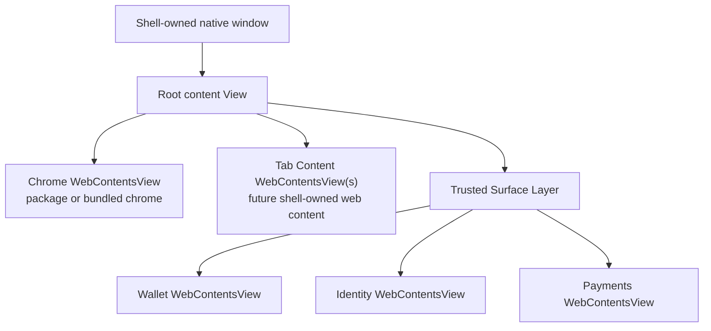
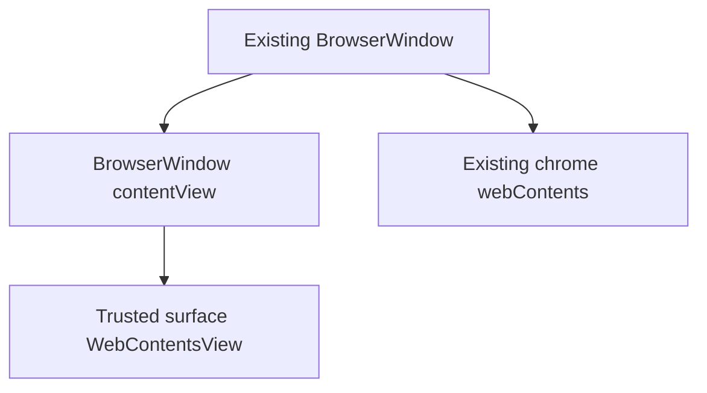

# Shell Compositor And WebContentsView Architecture

**Date:** 2026-06-25  
**Status:** Post-spike architecture draft
**Scope:** Desired architecture for package chrome, shell-owned trusted surfaces,
and a future main-process compositor built around Electron `WebContentsView`.

---

## Executive Summary

Local package chrome has made the trust boundary honest: the browser chrome can
no longer casually read wallet, identity, node, settings, or provider internals
through the broad bundled preload. That is correct, but it exposes the next
architectural problem.

Today, the main `BrowserWindow` is effectively "the chrome window." The chrome
renderer owns the visible layout, creates guest `<webview>` tabs, and used to
host wallet/sidebar/settings UI directly. Package mode needs a different
shape:

> Main should become the compositor and layout owner. Browser chrome should be
> one replaceable view inside a shell-owned native window, not the owner of the
> whole window.

The target architecture is a shell-owned window composed from multiple
main-created views:

- a package/bundled **chrome view**
- shell-owned **trusted surface views** for wallet, identity, payments, Swarm
  publish, permissions, and sensitive settings
- eventually shell-owned **tab content views**, replacing package-owned
  transitional `<webview>` tabs

Electron `WebContentsView` is the relevant primitive. It is a native `View`
with its own `webContents`, preload, permissions, lifecycle, and bounds. It is
not DOM inside package chrome. Main can attach it to a window's content view,
set bounds, show/hide it, and load trusted shell UI into it.

The spike clarified the most important boundary:

> Package chrome should never receive a raw `WebContentsView`, raw
> `webContents`, or an Electron-like proxy for either. Chrome owns the browser
> or app experience; shell owns the browser engine objects.

The important product consequence:

> Package chrome may request that a shell surface open or close, but shell
> decides whether that surface is a drawer, modal, sheet, panel, overlay, or
> detached fallback window. Chrome does not choose the trusted surface's size,
> position, contents, preload, or security context.

---

## Why This Exists

The package runtime has made several regressions visible:

- node menu controls can render desired state without fresh runtime telemetry
- shell-owned settings appear unavailable inside package-hosted settings pages
- wallet opens as a separate trusted window rather than the previous integrated
  sidebar
- package chrome correctly lacks wallet, identity, Swarm provider, dApp
  permission, and broad Electron globals

These are not random frontend bugs. They are symptoms of a deeper split:

- **Authority:** who can know or change the truth?
- **Presentation:** who draws the UI?
- **Placement:** who decides where the UI appears?

The old bundled renderer collapsed all three. Package chrome separates them.
This document specifies the architecture we want before implementing more
surface APIs ad hoc.

---

## Design Principles

1. **Shell owns authority.** Wallet keys, vault state, signing, identity,
   service lifecycle, node configuration, profile switching, permissions,
   updates, and irreversible security decisions remain in main or shell-owned
   trusted renderers.

2. **Shell owns trusted placement.** Package chrome can request a trusted
   surface, but main decides placement and dimensions.

3. **Chrome owns chrome.** The active chrome package owns its own visual theme,
   toolbar layout, density, package-specific preferences, and non-sensitive UI
   presentation.

4. **Safe state flows through narrow APIs.** Node status, bookmarks, history,
   safe settings, favicons, tab snapshots, and surface open/closed state should
   be exposed through capability-gated `freedomShell` APIs.

5. **Sensitive workflows are shell-owned surfaces.** Wallet, vault, identity,
   signing, x402 approvals, provider grants, Swarm publish approval, and
   dangerous node/profile settings should render in shell-owned WebContents,
   not in package chrome DOM.

6. **No DOM injection for trusted UI.** A "slot" must not mean "shell inserts
   wallet DOM into a package-provided element." Trusted pixels must come from a
   shell-owned native view or a shell-owned fallback window.

7. **Fallback remains mandatory.** If a chrome package is minimal, broken, or
   incompatible with an integrated surface layout, shell can still open a
   trusted modal/window independently of chrome.

8. **Raw engine handles stay private.** Package chrome must not receive
   Electron `WebContentsView`, `webContents`, `BrowserWindow`, session,
   permission, preload, or devtools handles. It receives capability-gated,
   semantic APIs instead.

9. **Browser UX is not browser-engine ownership.** A browser-shaped chrome
   package may fully own tabs as a product concept: tab strip, tab groups,
   split panes, address bar, keyboard model, command palette, and agent
   workflows. It should not directly instantiate or control the underlying
   Electron content renderers.

---

## Current Architecture Baseline

The README currently describes Freedom as an Electron application where:

- protocol logic lives in `src/main/`
- the renderer is a modular UI layer talking to main over IPC
- main manages Ant/IPFS/Radicle lifecycles, URL rewriting, persistent data, and
  service state
- `src/renderer/` owns tabs, navigation, address bar, menus, bookmarks bar, and
  settings UI

The package runtime has added a second chrome mode:

- bundled chrome uses the broad trusted preload and remains the fallback path
- local package chrome uses `src/main/package-preload.js`
- package chrome receives only `window.freedomShell`
- the official package source lives under `packages/official-browser-chrome/src/`
- the package runtime has browser-state, command, surface-control, and provider
  trust-boundary APIs

The remaining mismatch is window composition. `src/main/windows/mainWindow.js`
still creates a single `BrowserWindow`, whose primary `webContents` is the
chrome. That makes it hard to render shell-owned surfaces inside the same native
window without either:

- making them detached windows, or
- putting them back inside chrome DOM

Neither is the desired final architecture.

---

## Electron Primitive: WebContentsView

Electron 41 includes `WebContentsView`.

Relevant local type facts from `node_modules/electron/electron.d.ts`:

- `WebContentsView extends View`
- a `WebContentsView` has a readonly `webContents`
- constructor options accept `webPreferences`
- constructor options can adopt an existing `webContents`, and a `webContents`
  can only be presented in one `WebContentsView` at a time
- `View` supports `addChildView(view)`, `removeChildView(view)`,
  `setBounds(bounds)`, `getBounds()`, `setVisible(visible)`, and
  `setBackgroundColor(color)`
- `BaseWindow` / `BrowserWindow` expose a content view through
  `getContentView()` and can replace it with `setContentView(view)`
- Electron marks `BrowserView` as deprecated in favor of `WebContentsView`

Implication:

> Main can create multiple independently-secured web renderers and compose them
> in one native window without making one renderer own another renderer's DOM.

That is exactly the primitive needed for shell-owned surfaces.

---

## Desired Window Model

### Target Object Model

Introduce a main-process `ShellWindow` abstraction. It owns:

- the native Electron window
- the chrome `WebContentsView`
- a future tab/content view region
- trusted surface views
- layout state
- focus routing
- teardown lifecycle

Sketch:

```text
ShellWindow
  nativeWindow: BaseWindow | BrowserWindow host
  rootView: View
  chromeView: WebContentsView
  contentViews: Map<tabId, WebContentsView>        # future
  trustedSurfaces: Map<surfaceId, TrustedSurface>
  layoutState: ShellLayoutState
```

`TrustedSurface` owns:

```text
TrustedSurface
  id: "wallet" | "identity" | "payments" | ...
  view: WebContentsView
  owner: "shell"
  mode: "right-drawer" | "modal" | "sheet" | "panel" | "detached"
  bounds: Rectangle
  preload: trusted preload path
  webContents: trusted renderer webContents
```

### Target View Tree

Long-term composition:



Rejected composition:



The spike proved this is not the target. A child `WebContentsView` can be
created and loaded, but it does not reliably compose over the existing
`BrowserWindow.webContents`. The old page-backed `BrowserWindow` must become a
host for explicit child views, with chrome itself represented as a
`WebContentsView`.

### Spike Result: 2026-06-25

The feature-flagged spike answered the near-term question:

- Adding a shell-owned `WebContentsView` as a child of the existing
  `BrowserWindow` content view creates and loads the surface webContents, but
  does not reliably overlay the primary `BrowserWindow.webContents`.
- The viable topology is to make package chrome itself a `WebContentsView`
  hosted by main, then add shell-owned surfaces as sibling `WebContentsView`s
  in the same native window.
- The experiment is gated by `FREEDOM_EXPERIMENTAL_SHELL_COMPOSITOR=1` and only
  applies to local package chrome.
- The smoke test proves that package chrome, the host window, and the
  shell-owned test surface are separate webContents with separate bounds and
  that the shell-owned surface renders from main-owned HTML, not package DOM.

Concrete conclusion:

> The production refactor should not try to bolt trusted surfaces onto the old
> BrowserWindow page. It should introduce an explicit shell window/compositor
> host where chrome is only one child view among other shell-owned views.

---

## Raw WebContentsView Boundary

The chrome package must not be passed a raw `WebContentsView`, raw
`webContents`, or a remote object that is equivalent to either.

A raw engine object grants authority over far more than presentation:

- navigation via `loadURL` / `loadFile`
- arbitrary page scripting via `executeJavaScript`
- session, partition, cookies, storage, and permission surfaces
- preload and provider attachment decisions
- devtools and debugging hooks
- capture of rendered content
- web preferences such as sandboxing and web security
- permission interception and grant UI timing
- crash/reload lifecycle
- z-order relative to trusted shell UI

Those are shell responsibilities because they determine where a user actually
lands, what origin/identity the page receives, which provider bridge is
attached, what state the page can access, and whether trusted shell UI can be
obscured or spoofed.

Chrome package APIs should therefore be semantic:

```js
await freedomShell.tabs.create({ url, active: true })
await freedomShell.tabs.navigate({ tabId, input })
await freedomShell.tabs.activate({ tabId })
await freedomShell.tabs.close({ tabId })
await freedomShell.surfaces.open('wallet')
await freedomShell.layout.setContentRegion({ tabId, region: 'main' })
```

Main translates those requests into `WebContentsView` operations. Package
chrome observes redacted state and events. It does not hold the engine object.

This is not meant to make browser chrome weak. It is meant to make browser
chrome portable. The official Freedom browser, a Safari-like frontend, a
vertical-tabs frontend, and an agentic chat frontend should all speak the same
browser-shaped API when they need web content.

---

## Tab UX Versus Tab Engine

There are two different meanings of "owning tabs":

1. **Owning the tabbed browsing experience.** The chrome package decides how
   tabs look and behave as product UI: horizontal tabs, vertical tabs, groups,
   split panes, saved workspaces, command palette behavior, agent sidebars, and
   address-bar flows.
2. **Owning the tab engine.** The holder creates and controls Electron
   renderers, sessions, preloads, navigation, permissions, provider bridges,
   and committed identity.

Package chrome should own the first. Shell should own the second.

For a browser-style package, this means the package still builds the browser.
It just builds against a shell tab engine:

```text
package chrome
  renders tab strip/address bar/sidebar
  requests tab operations
  receives tab state/events
  provides layout hints

shell tab engine
  creates WebContentsView content renderers
  resolves navigation
  attaches provider/preload bridges
  tracks committed identity
  owns session/partition/security prefs
  composes content views into the shell window
```

For a non-browser package, such as an agentic chat app, the same model is even
more useful: it can request one or more shell-owned content views without
reimplementing a browser engine or inheriting raw Electron authority.

The current package-owned `<webview>` tabs are therefore a transition state, not
the final package API.

---

## Runtime Paths

Three paths can exist, but they should be named honestly:

1. **Legacy trusted chrome path.** Bundled chrome can remain a compatibility and
   fallback path while the package runtime matures. It may retain broader
   privileges temporarily because it is the old trusted app, not because this is
   the desired package model.
2. **Shell tab engine path.** Package chrome uses high-level
   `freedomShell.tabs.*`, `freedomShell.surfaces.*`, browser-state, service,
   and layout APIs. This is the target path for official package chrome and
   third-party chrome packages.
3. **Privileged raw engine path.** If raw renderer control is ever needed for
   devtools, automation, internal diagnostics, or a first-party experimental
   tool, it should be a separate signed/high-trust capability with explicit
   warnings. It must not be the default package-chrome API.

The official Freedom browser package should move to path 2. It should be the
reference client for the shell tab engine rather than a privileged exception.

---

## Authority And Presentation Matrix

| Area | Authority owner | Presentation owner | Placement owner | Package chrome role |
| --- | --- | --- | --- | --- |
| Chrome theme/density/layout | active chrome package | active chrome package | active chrome package within its view | full owner |
| Package-specific preferences | active chrome package, namespaced by package id | active chrome package | active chrome package | full owner |
| Tab strip, address bar, split/tab UX | active chrome package | active chrome package | active chrome package within its view | full owner of product UX |
| Tab content engine | shell/main | web page content | shell/main compositor | request operations, observe state, provide layout hints |
| Bookmarks/history/favicons/homepage/search | shell/main | chrome may render via narrow APIs | chrome for ordinary UI | read/write through scoped browser-state APIs |
| Node status | shell/main service registry | chrome may render safe telemetry | chrome for node menu | read through `services.read` |
| Node lifecycle/config | shell/main | shell-owned surface or validated chrome controls | shell | request only, if approved |
| Wallet account list | shell/main | trusted wallet surface | shell | request open/close, observe state |
| Signing/transactions | shell/main | trusted prompt/surface | shell | no direct role |
| Identity/vault | shell/main | trusted identity surface | shell | request open/close, observe state |
| x402 approvals/caps | shell/main | trusted payments surface | shell | request open/close, observe state |
| Swarm publish | shell/main | trusted publish surface | shell | request open/close, observe state |
| Profile switching/management | shell/main | shell-owned surface | shell | display sanitized profile state only |
| App updates/recovery | shell/main | shell-owned UI | shell | request check/install only |

---

## Surface Control Contract

Package chrome should not supply geometry.

Chrome can request intent:

```js
await freedomShell.surfaces.open('wallet')
await freedomShell.surfaces.close('wallet')
await freedomShell.surfaces.toggle('wallet')
const state = await freedomShell.surfaces.getState()
```

Shell decides placement:

```js
{
  wallet: {
    open: true,
    owner: 'shell',
    mode: 'right-drawer',
    reservedInsets: { right: 420 },
    focus: 'surface'
  }
}
```

Surface events remain informational:

```js
freedomShell.onEvent((event) => {
  if (event.type === 'surfaces.stateChanged') {
    // Chrome may adapt its layout, but does not own the surface.
  }
})
```

Rules:

- `open(surfaceId)` is a request, not a layout command.
- Shell may ignore unsupported requests, choose a fallback, or require a
  stronger capability.
- Shell may reserve space and notify chrome after the fact.
- Chrome may adapt around `reservedInsets`.
- Chrome cannot move, resize, inspect, script, or style the trusted surface.
- A surface can exist even when chrome is crashed, loading, or replaced.

---

## Surface Modes

Shell should support a small set of modes. These are shell decisions, not
package decisions.

| Mode | Description | Likely use |
| --- | --- | --- |
| `right-drawer` | Docked trusted panel on the right side of the app window | wallet, identity |
| `modal` | Centered trusted dialog over chrome/content | signing, approvals, vault unlock |
| `sheet` | Bottom or top sheet | compact confirmations, mobile-like layouts |
| `panel` | Larger shell-owned settings or management panel | node config, profile management |
| `detached` | Separate trusted window fallback | unsupported composition, multi-window edge cases |

For official package chrome, the first polished target should be:

- wallet as `right-drawer`
- identity as `right-drawer` or `panel`
- signing/approval/vault unlock as `modal`
- payments as `panel`
- Swarm publish as `panel`
- dangerous node configuration as `panel`

---

## Settings Strategy

Settings should be split by authority, not by current page location.

### Chrome-Owned Settings

Owned by the active chrome package:

- theme
- density
- toolbar layout
- package-specific behavior
- visual preferences that do not affect shell authority

These should be namespaced by package id. A future API could be:

```js
freedomShell.chromePreferences.get()
freedomShell.chromePreferences.update(patch)
```

or package-local storage if the shell does not need to synchronize it.

### Browser-State Settings

Shell-owned but safe for chrome to render and mutate through validation:

- show bookmarks bar
- homepage/start page preference
- default search/address behavior
- history UI preferences
- maybe download location preference, if mediated by shell

These belong in narrow `browserState.settings.*` APIs.

### Shell Settings

Shell-owned and rendered by shell surfaces:

- node lifecycle and node configuration
- profile switching and profile management
- wallet/vault/identity/security settings
- provider, RPC, and ENS verification settings
- permissions
- updates/recovery
- privacy/security toggles with irreversible consequences

These should not appear as inert "owned by shell" dead ends inside package
chrome. The package-hosted settings page should route users to shell-owned
settings surfaces where appropriate.

---

## Node Menu Strategy

The node menu problem should not be solved with a trusted surface first. It is
mostly safe telemetry and should be a narrow service-state API.

Model:

```js
freedomShell.services.getState()
freedomShell.onEvent('services.changed', ...)
```

State should distinguish:

- desired enabled state: the user/profile wants the service enabled
- runtime state: stopped, starting, running, degraded, error
- mode: bundled, external, disabled, unavailable
- sanitized endpoint display: if safe
- version
- peer/request/data metrics
- last error and last updated timestamp

Example:

```js
{
  ant: {
    desiredEnabled: true,
    runtimeState: 'running',
    mode: 'bundled',
    peers: { connected: 12, visible: 34 },
    version: '...',
    lastUpdatedAt: 1782412345678
  },
  ipfs: {
    desiredEnabled: true,
    runtimeState: 'running',
    activeRequests: 0,
    dataReadBytes: 0,
    version: 'freedom-ipfs 0.4.3'
  },
  radicle: {
    desiredEnabled: true,
    runtimeState: 'running',
    connectedPeers: 8,
    seededRepositories: 3,
    version: '1.9.1'
  }
}
```

Dangerous controls such as changing endpoints, wiping data, switching node
mode, exporting keys, or reconfiguring RPC should route to shell-owned settings
surfaces.

---

## Migration Plan

### Phase 0: Architecture Record - Complete

This document.

Exit criteria:

- desired compositor architecture is written down
- DOM slotting is explicitly rejected for trusted surfaces
- shell-owned placement is the default
- raw `WebContentsView` / `webContents` handles are explicitly kept out of the
  package API
- browser UX ownership is separated from browser-engine ownership

### Phase 1: WebContentsView Spike - Complete

Goal: prove we can render shell-owned views in the same native window without
putting them inside chrome DOM.

Implemented:

- `FREEDOM_EXPERIMENTAL_SHELL_COMPOSITOR=1`
- local package chrome can run as a main-owned `WebContentsView`
- a shell-owned `testSurface` can render as a sibling `WebContentsView`
- package chrome requests the surface through `freedomShell.surfaces.*`
- package chrome cannot access the surface DOM
- e2e proves separate host/chrome/surface webContents and rendered surface
  pixels

Finding:

- attaching a child `WebContentsView` to the old page-backed `BrowserWindow`
  is not a reliable composition strategy
- the production direction should be explicit shell composition, with chrome
  itself hosted as a child `WebContentsView`

### Phase 2: Promote ShellWindow Compositor Host - First Checkpoint Complete

Goal: turn the successful spike topology into a real `ShellWindow`
architecture.

First checkpoint implemented:

- `src/main/windows/shell-window.js` now owns the shell window abstraction
- local package chrome runs as `ShellWindow.chromeView` without the experiment
  flag
- bundled chrome remains on the legacy `BrowserWindow.webContents` path for
  compatibility during this checkpoint
- package registration, readiness, rollback, recovery, blur/menu events, and
  application-menu commands target `ShellWindow.chromeWebContents`
- the host `BrowserWindow.webContents` is a hardened blank compositor host in
  local package mode
- smoke coverage proves package mode, fallback/rollback, native menu commands,
  external package-window close behavior, and bundled smoke

Remaining Phase 2 work:

- move or wrap remaining focus/profile/window-control assumptions as needed
  while building real shell surfaces
- decide whether bundled chrome should also move to a chrome
  `WebContentsView`
- keep validating shutdown behavior as more sibling surfaces are added
- replace the dummy `testSurface` spike with the real surface manager in
  Phase 3

Current assumption to break:

```text
BrowserWindow.webContents === chrome webContents
```

Target:

```text
ShellWindow.nativeWindow owns the native window
ShellWindow.chromeView owns package/bundled chrome pixels
ShellWindow.chromeWebContents is the IPC/event target for chrome
ShellWindow.trustedSurfaces owns shell surfaces
```

Implementation sketch:

- introduce `src/main/windows/shell-window.js`
- move main window bookkeeping behind a `ShellWindow` object
- keep `BrowserWindow` as the native host initially if practical, but do not
  load chrome in its primary `webContents`
- create chrome as a `WebContentsView` for local package mode
- decide whether bundled chrome moves immediately to a chrome view or remains
  compatibility-only during the first refactor
- replace broad use of `mainWindow.webContents` with explicit
  `shellWindow.chromeWebContents`
- update package registration and caller identity registration
- update shell event routing to target `chromeWebContents`
- update menu command routing
- update focus helpers and profile focus handoff
- update window-control APIs to operate on the native window, not the chrome
  view
- preserve package update/rollback/recovery behavior
- keep the current trusted detached-window fallback paths

Exit criteria:

- local package chrome runs through `ShellWindow.chromeView` without the
  experiment flag
- package runtime smoke passes
- bundled chrome smoke passes
- package update, rollback, and fallback tests pass
- shutdown remains clean in dev mode
- shell surfaces can be composed as siblings above or alongside chrome
- no package API exposes raw view/webContents handles

### Phase 3: Shell-Owned Surface Manager - First Wallet Checkpoint Complete

Goal: replace ad hoc trusted windows and the dummy `testSurface` with a real
main-owned surface manager.

This should come after the compositor host is stable. The first polished target
can be wallet as a right drawer, but the surface manager should be generic.

First wallet checkpoint implemented:

- `ShellWindow` can host trusted right-drawer surface facades backed by sibling
  `WebContentsView`s
- package chrome still receives only `freedomShell.openSurface/closeSurface`
  intent APIs and redacted surface state
- the trusted wallet renderer and preload stay shell-owned and are reused
  unchanged
- in local package mode, wallet opens as a sibling trusted
  `WebContentsView` with `mode: shell-owned-webcontents-view`
- the detached trusted wallet `BrowserWindow` path remains the fallback for
  non-compositor owners
- vault-unlock prompts opened from the compositor wallet still parent to the
  native shell window
- smoke proves wallet open, trusted sender checks, wallet management actions,
  vault unlock prompt, close/reopen state, and removal from compositor debug
  state

Implementation sketch:

- add a surface registry:
  - `wallet`
  - `identity`
  - `payments`
  - `swarmPublish`
  - `nodeSettings`
  - `profileSettings`
- each surface declares:
  - capability requirement
  - trusted entry file
  - trusted preload
  - default mode
  - minimum size
  - focus behavior
  - state serializer
- shell owns placement modes:
  - `right-drawer`
  - `modal`
  - `sheet`
  - `panel`
  - `detached`
- package chrome continues to request intent only:
  - open
  - close
  - toggle
  - get state
- shell emits redacted state and optional reserved inset information

Exit criteria:

- wallet can open as a shell-owned right drawer or panel in package mode
- current trusted wallet detached-window fallback remains available
- package chrome receives state only
- package chrome cannot read wallet/identity globals or trusted surface DOM
- smoke proves surface composition, close/reopen, resize, focus, and shutdown

### Phase 4: Shell-Owned Tab Engine

Goal: move guest page content out of package-owned `<webview>` tabs.

This is the second major todo and the bigger product/API project.

Target:

- main owns tab/content `WebContentsView`s
- chrome requests tab operations through high-level `freedomShell.tabs.*`
- chrome renders tab strip/address UI from shell state
- package chrome may provide layout hints, but main validates and composes
  content views
- package chrome does not create guest webviews
- provider identity and committed origin authority stay in main
- raw Electron content handles never cross into package chrome

Initial API shape:

```js
await freedomShell.tabs.create({ url, active: true })
await freedomShell.tabs.navigate({ tabId, input })
await freedomShell.tabs.activate({ tabId })
await freedomShell.tabs.close({ tabId })
await freedomShell.tabs.reload({ tabId })
await freedomShell.tabs.stop({ tabId })
await freedomShell.layout.setContentRegion({ tabId, region: 'main' })
```

Events:

```js
freedomShell.onEvent((event) => {
  if (event.type === 'tabs.changed') {
    // title, favicon, loading, committedDisplayUrl, active tab, etc.
  }
})
```

Exit criteria:

- official package chrome uses shell tab APIs for core tab workflows
- package chrome no longer needs `guestContent.transitionalWebviews`
- page content receives shell-owned provider/preload bridges
- tab snapshots become main-derived
- tab commands return real execution results
- navigation, provider identity, permissions, history, favicon, and crash
  handling remain correct

### Phase 5: Production Package Runtime

Goal: remove development-only scaffolding and make shell-composed package chrome
the normal official runtime path.

Exit criteria:

- official package mode reaches parity for core browser workflows
- package update/rollback still works
- shell recovery UI works if chrome package fails
- trusted surfaces work when chrome is unavailable
- Swarm delivery can be added without changing the authority model

---

## Deprecated Plan Fragments

The following ideas are now explicitly deprecated by the spike:

- attaching trusted shell UI as DOM inside package chrome
- passing raw or proxy `WebContentsView` objects to package chrome
- relying on package-owned `<webview>` tabs as the final tab/content model
- treating `BrowserWindow.webContents` as synonymous with chrome webContents
- attempting to solve integrated wallet/settings by making package chrome more
  privileged

---

## Testing Strategy

Unit tests:

- pure layout calculations for surface bounds and reserved insets
- surface registry capability mapping
- state serialization redaction
- lifecycle cleanup idempotency
- package sender/capability gating

Integration tests:

- create/destroy the chrome `WebContentsView` host without leaking
- create/destroy `WebContentsView` surfaces without leaking
- open/close/reopen surfaces
- resize native window and verify bounds updates
- focus transitions between chrome and surface
- shutdown with surfaces open

E2E smoke:

- package chrome runs as a child `WebContentsView`
- host, chrome, surface, and future content webContents identities are distinct
- package chrome opens wallet surface
- package chrome cannot read wallet globals or surface DOM
- wallet surface displays shell-owned trusted UI
- close button and Escape close the surface
- surface state event reaches package chrome
- package chrome adapts to reserved inset
- bundled chrome still starts
- package chrome still starts
- package update/rollback/fallback still works
- one Ctrl+C exits dev package run

Screenshot/pixel checks:

- shell-owned surface visible in correct region
- no overlap with title bar controls
- no accidental blank `WebContentsView`
- drawer/panel has stable dimensions across desktop sizes

---

## Security Invariants

- Package chrome never receives wallet, vault, identity, mnemonic, private-key,
  raw provider, raw x402, raw Swarm publish, or dApp permission-store APIs.
- Package chrome never receives raw `WebContentsView`, raw `webContents`,
  `BrowserWindow`, session, permission, preload, devtools, or capture handles.
- Trusted surfaces are separate WebContents with shell-owned preload and
  main-owned lifecycle.
- Package chrome cannot inspect, script, style, resize, move, or obscure trusted
  surface internals through an API.
- Package chrome cannot directly `loadURL`, execute JavaScript, set
  webPreferences, attach provider APIs, or intercept permission requests for
  content views.
- Surface requests are capability-gated by package identity.
- Surface state events are informational and redacted.
- Main derives security identity from committed webContents state, not from
  package chrome claims.
- Shell can render recovery or trusted surfaces even when chrome is crashed or
  incompatible.
- No third-party or dApp chrome may receive high-trust surface integration by
  default; capability tiers remain a product/security decision.

---

## Open Questions After The Spike

Resolved:

- `BrowserWindow.getContentView().addChildView(...)` does not reliably compose
  over the existing primary BrowserWindow webContents.
- Chrome itself should be a `WebContentsView` child of a shell-owned native
  host.
- Raw engine handles should remain private to shell/main.

Still open:

1. Should the native host be `BrowserWindow` with a blank/hardened primary
   webContents, or should the production refactor move directly to
   `BaseWindow`?
2. Should bundled chrome move to `WebContentsView` immediately, or should the
   first productionized compositor path target local package chrome only?
3. Can trusted views receive focus and keyboard shortcuts without breaking
   chrome shortcuts?
4. How should DevTools attach for chrome, content, and trusted surfaces?
5. What is the right accessibility story for a trusted drawer/panel?
6. How should fullscreen web content interact with shell-owned surfaces?
7. Which surfaces should reserve layout space versus overlay chrome/content?
8. How much trusted surface state should be exposed to chrome?
9. Should package manifests declare that they visually support reserved insets,
   or should shell always be able to overlay independently?
10. What is the minimum viable replacement for the current wallet popup?
11. What is the smallest shell tab engine API that lets official package chrome
    reach parity without exposing raw content handles?

---

## Recommended Next Work Packages

### Work Package 1: Productionize `ShellWindow`

Promote the spike topology into a real main-owned compositor host.

Suggested target:

- add `ShellWindow`
- make local package chrome run as `ShellWindow.chromeView`
- route package registration, shell events, menu commands, focus, and window
  controls through explicit `chromeWebContents`
- preserve package fallback/update/recovery
- keep raw view/webContents handles private
- keep `testSurface` only as a dev/test probe or replace it with the surface
  manager's test fixture

This is mostly architecture plumbing. It should happen before migrating wallet,
because wallet should land on the real compositor rather than another temporary
host.

### Work Package 2: Design And Start The Shell Tab Engine

Define the smallest high-level tab/content API that lets official package chrome
stop creating package-owned `<webview>` tabs.

Suggested target:

- write the tab engine contract first
- identify exact operations official chrome uses today
- implement one narrow vertical slice:
  - create one shell-owned content `WebContentsView`
  - navigate it through main-owned resolution
  - expose title/loading/committed URL state
  - let package chrome activate/close it by tab id
- keep provider injection and committed identity in main
- prove package chrome cannot obtain raw content handles

This is the larger project. It can start as a design/spec work package while
`ShellWindow` productionization proceeds.

---

## Strategic Decision

The desired architecture is:

> Freedom Browser is a shell-owned native compositor. Chrome is a replaceable
> frontend view. Web content and trusted shell surfaces are independently owned
> views. Main controls layout, authority, lifecycle, and recovery.

This is the clean path from local package chrome to Swarm-delivered chrome. It
also makes the product model clearer:

- package chrome can be beautiful, replaceable, and fast-moving
- shell remains the trusted operating environment
- wallet/identity/node/security UI can feel integrated without becoming chrome
  code
- future app-specific frontends can exist without taking over the security
  boundary
